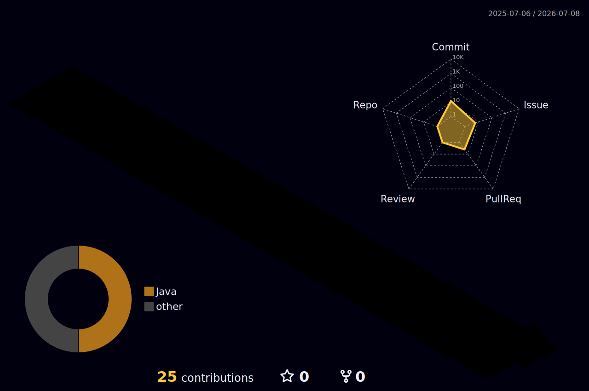

<!-- ═══════════════════════════ HEADER BANNER ═══════════════════════════ -->

<!-- ═══════════════════════════ TYPING ROLES ════════════════════════════ -->

 

<!-- ═══════════════════════════ VISITOR BADGE ════════════════════════════ -->

 

---

## 🧠 About Me

**Full-Stack × AI Engineer** — I am the entire IT department.

- 🔭 **Building:** LLM-powered products, autonomous agent workflows & production-grade APIs
- 🌱 **Deep in:** Agentic AI · RAG Pipelines · Multi-modal LLMs · Vector Search
- 🤝 **Open to:** Collabs, freelance projects & full-time roles
- 📍 **Based in:** Vietnam 🇻🇳
- 📬 **Reach me:** *(coming soon)*

---

## 🛠️ Tech Stack

**Languages**

**Frontend**

**Backend & APIs**

**AI / ML**

 

**Databases**

**DevOps & Infra**

---

## 📊 GitHub Stats

<table>
  <tr>
    <td>
      
    </td>
    <td>
      
    </td>
  </tr>
</table>

 

 

---

## 🔥 What I'm Shipping Right Now

| Project | Stack | Status |
|---------|-------|--------|
| 🤖 LLM Agent — multi-step reasoning & tool use | Python · LangChain · FastAPI | 🚧 In Progress |
| 🧬 RAG Pipeline — Qdrant vector search | FastAPI · Qdrant · OpenAI | 🚧 In Progress |
| ⚡ AI Dashboard — real-time inference UI | Next.js · TypeScript · WebSockets | 🚧 In Progress |

---

## 📈 3D Contribution Graph

  

---

⚡ I replace entire IT teams. Plural. 
🧠 I think in systems, build in sprints, ship in production. 
☕ Fueled by Vietnamese coffee and stubborn optimism.

 

<!-- ═══════════════════════════ FOOTER BANNER ════════════════════════════ -->

